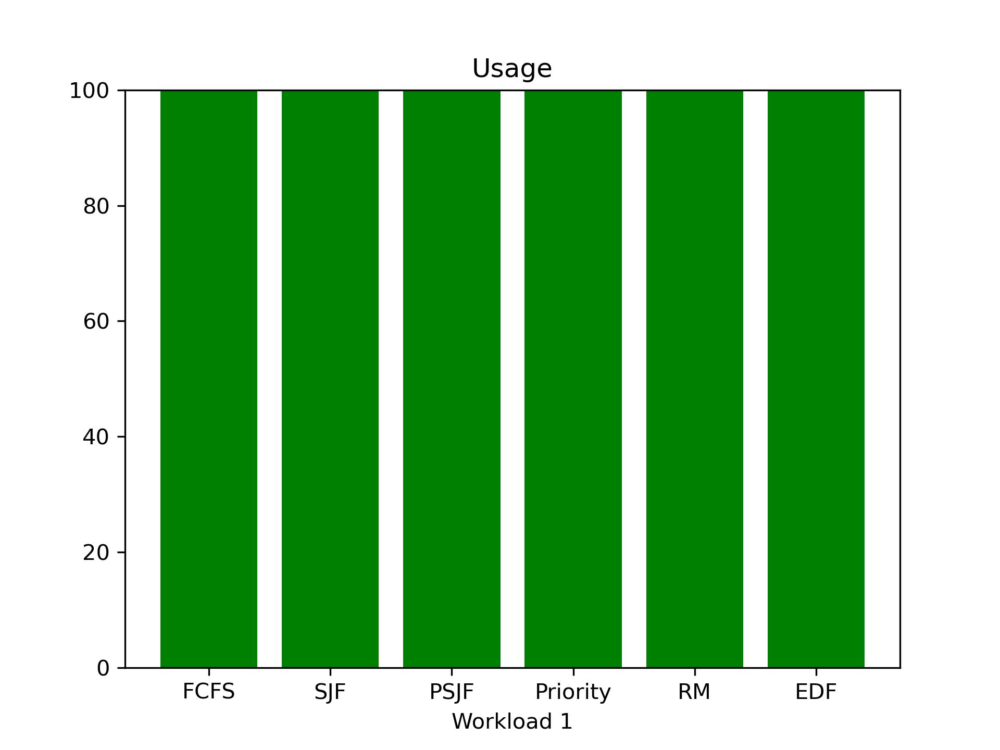
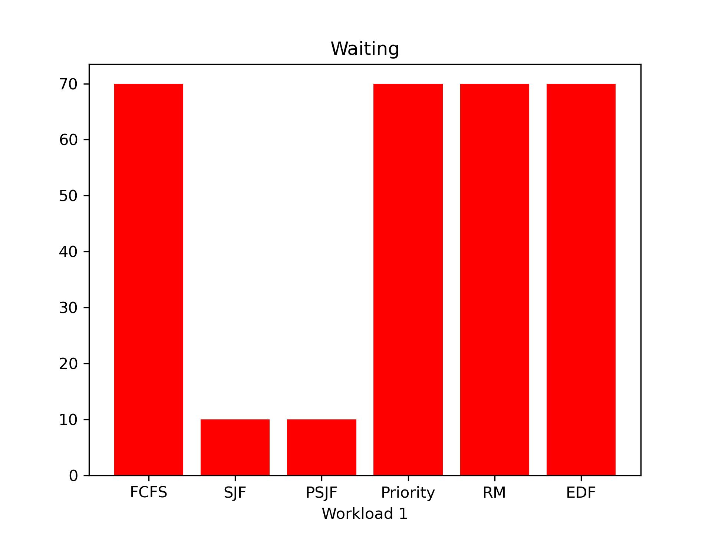
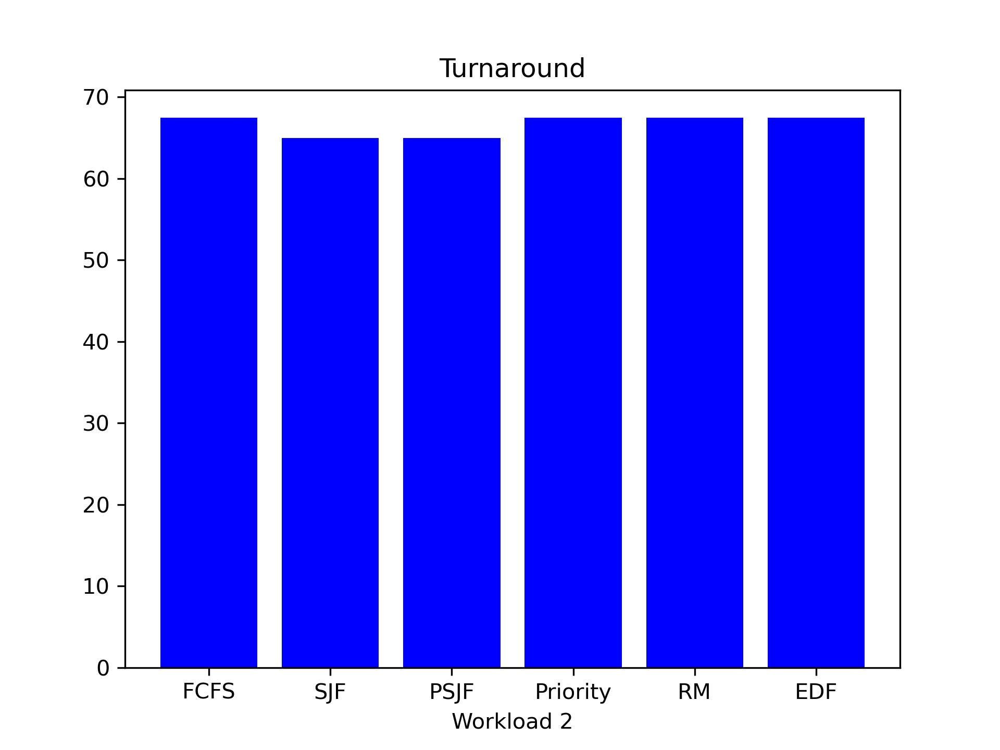
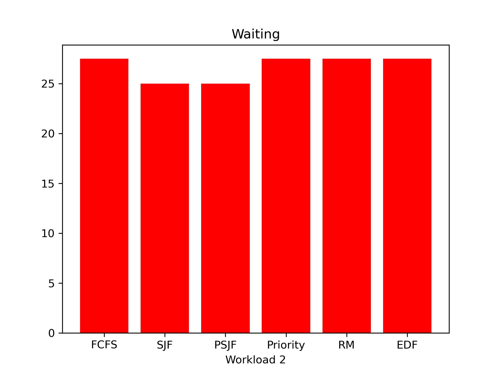
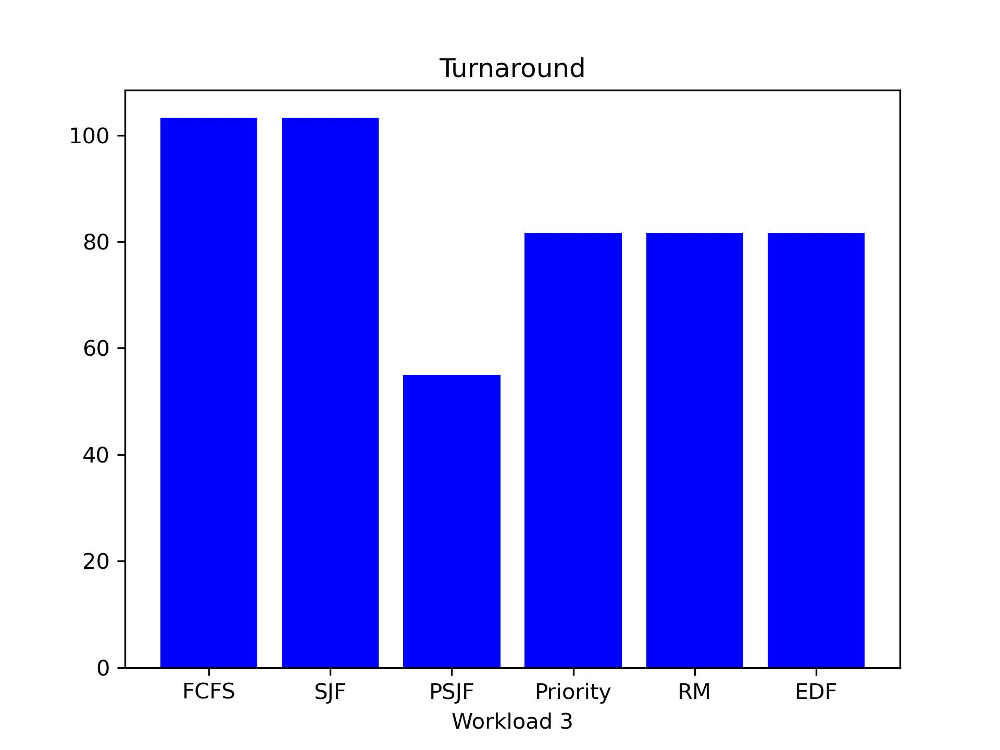
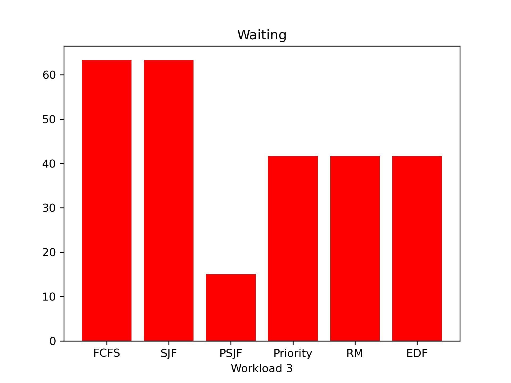
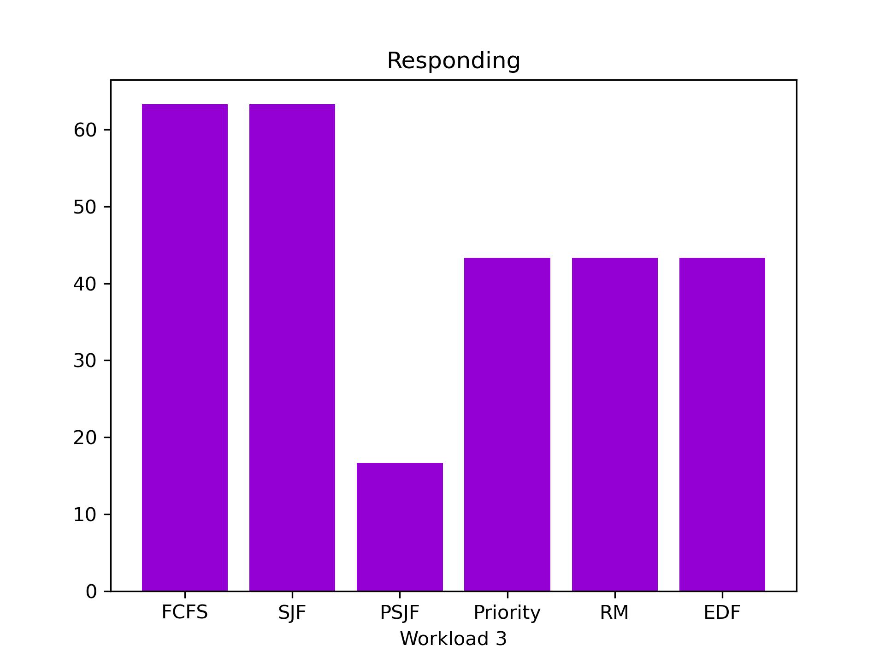
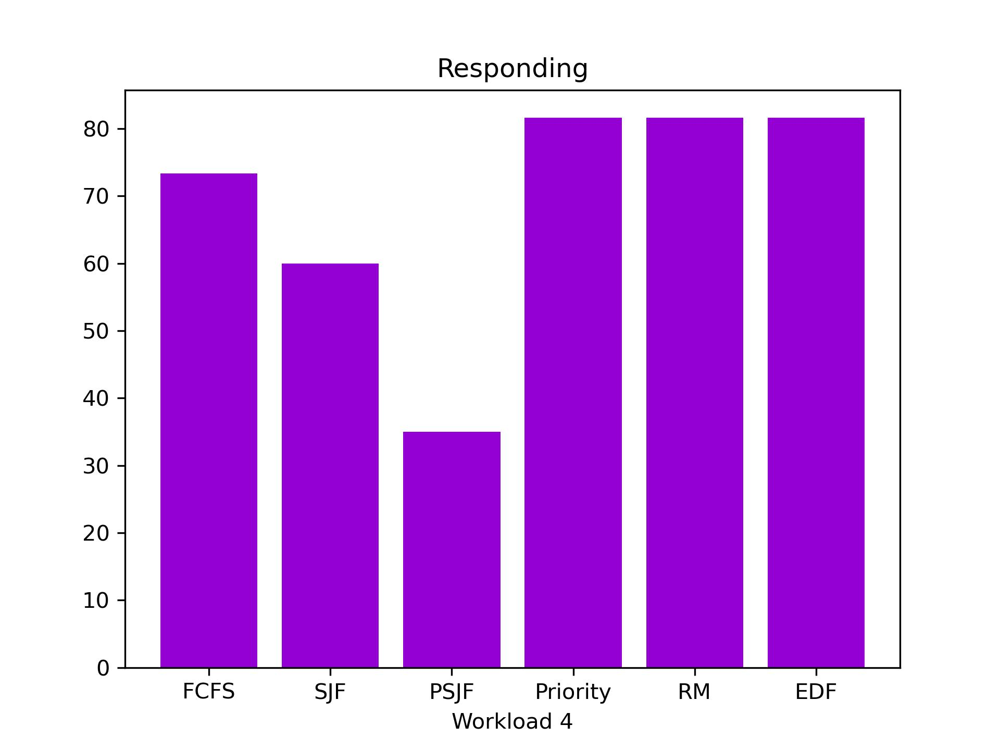
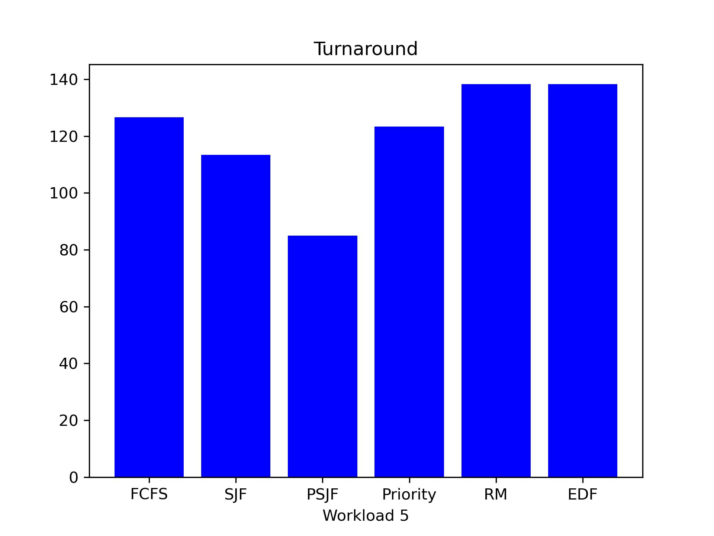
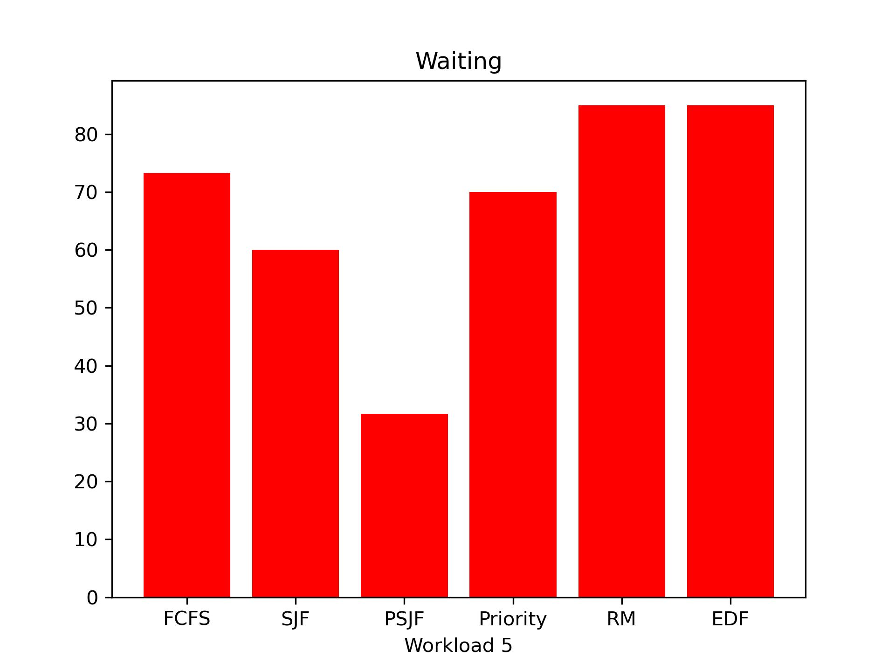

# Scheduling Simulator

This project simulates various real time algorithms and benchmarks their
performance in different scenarios.

Implemented algorithms:

 - [x] First Come, First Served (FCFS)
 - [x] Shortest Job First (SJF)
 - [x] Preemptive Shortest Job First (PSJF)
 - [x] Priority based
 - [x] Rate monotonic (RM)
 - [x] Earliest Deadline First (EDF)
 - [ ] Round Robin (RR)

# Metrics

In order to compare scheduling algorithms we will evaluate them based on the
following metrics:

- [x] Turnaround time (T_completion - T_arrival)
- [x] Waiting time (T_turnaround - T_burst)
- [x] Response time (T_first_on_cpu - T_arrival)

# Results

# References
- https://pages.cs.wisc.edu/~remzi/OSTEP/cpu-sched.pdf
- Operating System Concepts, 10th Edition
by Abraham Silberschatz, Peter B. Galvin, Greg Gagne
- Liu, C. L.; Layland, J. (1973), "Scheduling algorithms for multiprogramming in a hard real-time environment", Journal of the ACM, 20 (1), pp. 46–61
